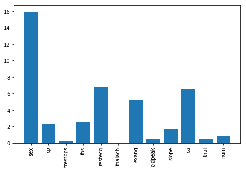
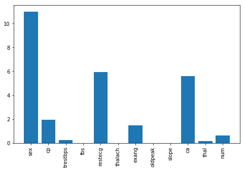
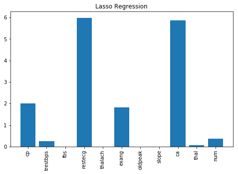
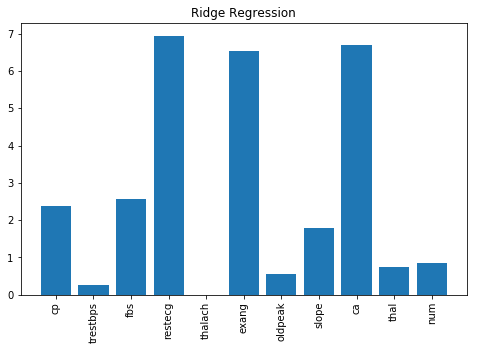
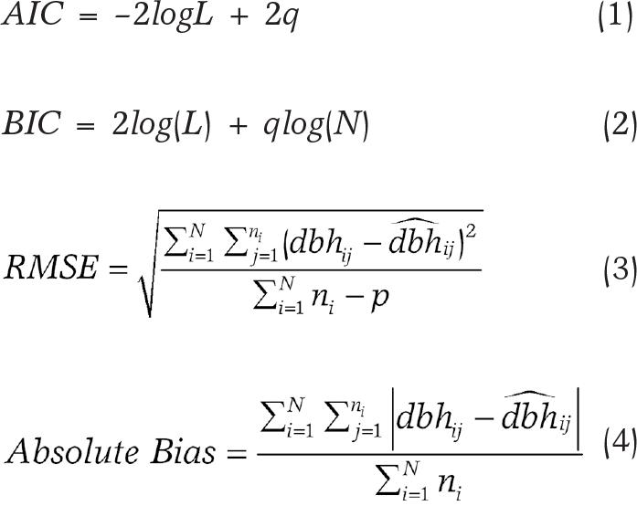
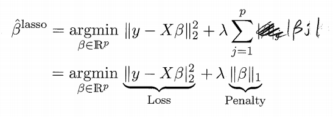
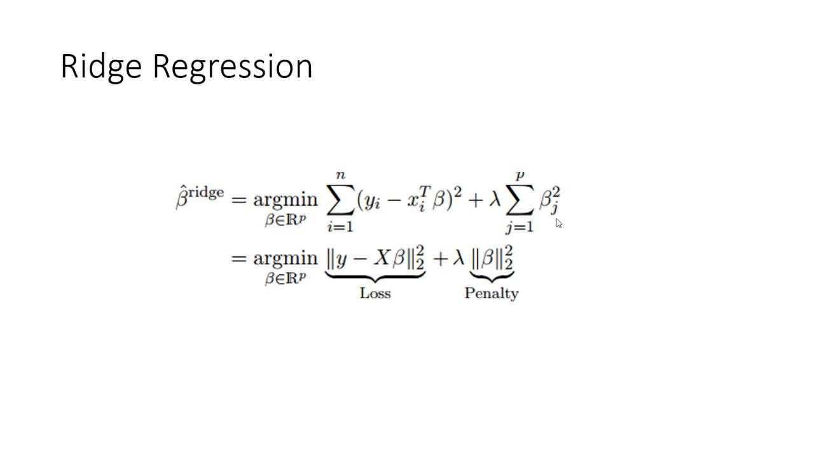

### Questions
- To test for interactions, run an experiment. 
- When you have an interaction you lose interpretability on the individual columns

### Objectives
YWBAT 
- explain bias/variance tradeoff
- explain ridge regression
- explain lasso regression
- explain AIC and BIC

### What are the assumptions of linear regression? 

**Features and Target**
- Linear Relationship between the features and the target
- Multicollinearity - features cannot have multicollinearity

**Assumptions on your Residuals**
- Normality Assumption
- Homoskedacicity - want this to be true of the residuals
- Autocorrelation - no correlation between features and residuals


### Keyterms
- lambda penalty parameter
- penalty size

### Outline


```python
import pandas as pd
import numpy as np

import statsmodels.api as sm

from sklearn.linear_model import Lasso, Ridge, LinearRegression
from sklearn.model_selection import train_test_split


import matplotlib.pyplot as plt
```


```python
df = pd.read_csv("data/BNG_cholesterol.csv")
df.head()
```


<div>
<style scoped>
    .dataframe tbody tr th:only-of-type {
        vertical-align: middle;
    }

    .dataframe tbody tr th {
        vertical-align: top;
    }

    .dataframe thead th {
        text-align: right;
    }
</style>
<table border="1" class="dataframe">
  <thead>
    <tr style="text-align: right;">
      <th></th>
      <th>age</th>
      <th>sex</th>
      <th>cp</th>
      <th>trestbps</th>
      <th>fbs</th>
      <th>restecg</th>
      <th>thalach</th>
      <th>exang</th>
      <th>oldpeak</th>
      <th>slope</th>
      <th>ca</th>
      <th>thal</th>
      <th>num</th>
      <th>chol</th>
    </tr>
  </thead>
  <tbody>
    <tr>
      <td>0</td>
      <td>46.950938</td>
      <td>1</td>
      <td>1</td>
      <td>165.981331</td>
      <td>0</td>
      <td>2</td>
      <td>152.691434</td>
      <td>0</td>
      <td>1.774223</td>
      <td>2</td>
      <td>0</td>
      <td>7</td>
      <td>3</td>
      <td>265.569780</td>
    </tr>
    <tr>
      <td>1</td>
      <td>47.359284</td>
      <td>1</td>
      <td>4</td>
      <td>134.748286</td>
      <td>0</td>
      <td>2</td>
      <td>132.079047</td>
      <td>1</td>
      <td>0.407640</td>
      <td>2</td>
      <td>0</td>
      <td>7</td>
      <td>0</td>
      <td>269.368061</td>
    </tr>
    <tr>
      <td>2</td>
      <td>58.455787</td>
      <td>1</td>
      <td>4</td>
      <td>129.456617</td>
      <td>0</td>
      <td>0</td>
      <td>164.523754</td>
      <td>1</td>
      <td>5.284900</td>
      <td>2</td>
      <td>0</td>
      <td>7</td>
      <td>4</td>
      <td>244.336917</td>
    </tr>
    <tr>
      <td>3</td>
      <td>56.070298</td>
      <td>1</td>
      <td>4</td>
      <td>124.831749</td>
      <td>0</td>
      <td>2</td>
      <td>181.453944</td>
      <td>0</td>
      <td>1.096476</td>
      <td>1</td>
      <td>1</td>
      <td>7</td>
      <td>2</td>
      <td>237.985356</td>
    </tr>
    <tr>
      <td>4</td>
      <td>44.121116</td>
      <td>1</td>
      <td>4</td>
      <td>109.887955</td>
      <td>0</td>
      <td>2</td>
      <td>110.055090</td>
      <td>1</td>
      <td>0.437412</td>
      <td>2</td>
      <td>0</td>
      <td>3</td>
      <td>1</td>
      <td>245.907334</td>
    </tr>
  </tbody>
</table>
</div>


```python
features_to_use = ['exang', 'fbs', 'restecg', 'thal']
target = ['chol']
```


```python
linreg = sm.OLS(df[target], df[df.drop(columns=['chol']).columns]).fit()
linreg.summary()
```


<table class="simpletable">
<caption>OLS Regression Results</caption>
<tr>
  <th>Dep. Variable:</th>          <td>chol</td>       <th>  R-squared (uncentered):</th>       <td>   0.959</td>  
</tr>
<tr>
  <th>Model:</th>                   <td>OLS</td>       <th>  Adj. R-squared (uncentered):</th>  <td>   0.959</td>  
</tr>
<tr>
  <th>Method:</th>             <td>Least Squares</td>  <th>  F-statistic:       </th>           <td>1.800e+06</td> 
</tr>
<tr>
  <th>Date:</th>             <td>Fri, 08 Nov 2019</td> <th>  Prob (F-statistic):</th>            <td>  0.00</td>   
</tr>
<tr>
  <th>Time:</th>                 <td>13:25:26</td>     <th>  Log-Likelihood:    </th>          <td>-5.3515e+06</td>
</tr>
<tr>
  <th>No. Observations:</th>      <td>1000000</td>     <th>  AIC:               </th>           <td>1.070e+07</td> 
</tr>
<tr>
  <th>Df Residuals:</th>          <td>999987</td>      <th>  BIC:               </th>           <td>1.070e+07</td> 
</tr>
<tr>
  <th>Df Model:</th>              <td>    13</td>      <th>                     </th>               <td> </td>     
</tr>
<tr>
  <th>Covariance Type:</th>      <td>nonrobust</td>    <th>                     </th>               <td> </td>     
</tr>
</table>
<table class="simpletable">
<tr>
      <td></td>        <th>coef</th>     <th>std err</th>      <th>t</th>      <th>P>|t|</th>  <th>[0.025</th>    <th>0.975]</th>  
</tr>
<tr>
  <th>age</th>      <td>    1.4258</td> <td>    0.005</td> <td>  285.707</td> <td> 0.000</td> <td>    1.416</td> <td>    1.436</td>
</tr>
<tr>
  <th>sex</th>      <td>  -13.2932</td> <td>    0.115</td> <td> -115.276</td> <td> 0.000</td> <td>  -13.519</td> <td>  -13.067</td>
</tr>
<tr>
  <th>cp</th>       <td>    5.8796</td> <td>    0.054</td> <td>  109.203</td> <td> 0.000</td> <td>    5.774</td> <td>    5.985</td>
</tr>
<tr>
  <th>trestbps</th> <td>    0.6679</td> <td>    0.002</td> <td>  283.377</td> <td> 0.000</td> <td>    0.663</td> <td>    0.672</td>
</tr>
<tr>
  <th>fbs</th>      <td>    3.4092</td> <td>    0.142</td> <td>   24.068</td> <td> 0.000</td> <td>    3.132</td> <td>    3.687</td>
</tr>
<tr>
  <th>restecg</th>  <td>    7.3749</td> <td>    0.052</td> <td>  143.157</td> <td> 0.000</td> <td>    7.274</td> <td>    7.476</td>
</tr>
<tr>
  <th>thalach</th>  <td>    0.2956</td> <td>    0.002</td> <td>  159.151</td> <td> 0.000</td> <td>    0.292</td> <td>    0.299</td>
</tr>
<tr>
  <th>exang</th>    <td>    2.8243</td> <td>    0.118</td> <td>   23.995</td> <td> 0.000</td> <td>    2.594</td> <td>    3.055</td>
</tr>
<tr>
  <th>oldpeak</th>  <td>    0.2527</td> <td>    0.048</td> <td>    5.252</td> <td> 0.000</td> <td>    0.158</td> <td>    0.347</td>
</tr>
<tr>
  <th>slope</th>    <td>    2.3585</td> <td>    0.085</td> <td>   27.851</td> <td> 0.000</td> <td>    2.193</td> <td>    2.524</td>
</tr>
<tr>
  <th>ca</th>       <td>    7.0432</td> <td>    0.058</td> <td>  121.056</td> <td> 0.000</td> <td>    6.929</td> <td>    7.157</td>
</tr>
<tr>
  <th>thal</th>     <td>    1.6654</td> <td>    0.030</td> <td>   55.635</td> <td> 0.000</td> <td>    1.607</td> <td>    1.724</td>
</tr>
<tr>
  <th>num</th>      <td>    0.6076</td> <td>    0.043</td> <td>   14.289</td> <td> 0.000</td> <td>    0.524</td> <td>    0.691</td>
</tr>
</table>
<table class="simpletable">
<tr>
  <th>Omnibus:</th>       <td>72929.043</td> <th>  Durbin-Watson:     </th> <td>   2.001</td> 
</tr>
<tr>
  <th>Prob(Omnibus):</th>  <td> 0.000</td>   <th>  Jarque-Bera (JB):  </th> <td>96856.071</td>
</tr>
<tr>
  <th>Skew:</th>           <td> 0.648</td>   <th>  Prob(JB):          </th> <td>    0.00</td> 
</tr>
<tr>
  <th>Kurtosis:</th>       <td> 3.803</td>   <th>  Cond. No.          </th> <td>    576.</td> 
</tr>
</table><br/><br/>Warnings:<br/>[1] Standard Errors assume that the covariance matrix of the errors is correctly specified.


### What is statsmodels doing under the hood to find the coefficients
- It's performing gradient descent

### In OLS as dimensions increase, what happens?
- Increase the complexity of the model
- Increase the possibility of multicollinearity
- Increase your chances of overfitting

### The problem with Gradient Descent, is...prone to overfitting, because all it wants to do is minimize error. 

# This is where we introduce a penalty $\lambda$ 

### The penalty will penalize your loss based on number of parameters of our model

Example

**Regular Loss Function**
    - MSE
    
**Penalized Loss Function L1-Lasso**

$$\lambda = \sum{\bar{\beta_i}}$$

    - MSE + `np.sum(np.abs(Beta_coeffients))`
    
**Penalized Loss Function L2 - Ridge**
 
$$\lambda =  \sum{\beta_i^2}$$

    - MSE + `np.sum(Beta_coeffients**2)`

### Ridge and Lasso regression effect our cost function


```python
from sklearn.linear_model import LinearRegression, Ridge, Lasso
```


```python
X = df.drop(columns=['chol', 'age', 'sex'])
y = df['chol']
```


```python
lr = LinearRegression()
lr.fit(X, y)
```


    LinearRegression(copy_X=True, fit_intercept=True, n_jobs=None, normalize=False)


# Plot coefficients


```python
cols = X.columns
coeffs = lr.coef_
```


```python
plt.figure(figsize=(8, 5))
plt.bar(cols, np.abs(coeffs))
plt.xticks(rotation=90)
plt.show()
```





## let's repeat this for Lasso Regression
- Fewer betas that are significant
- Smaller beta values from previous LR have disappeared


```python
lr = Lasso()
lr.fit(X, y)

cols = X.columns
coeffs = lr.coef_

plt.figure(figsize=(8, 5))
plt.bar(cols, np.abs(coeffs))
plt.xticks(rotation=90)
plt.show()
```





### let's repeat this for Ridge


```python
lr = Ridge()
lr.fit(X, y)

cols = X.columns
coeffs = lr.coef_

plt.figure(figsize=(8, 5))
plt.bar(cols, np.abs(coeffs))
plt.xticks(rotation=90)
plt.show()
```


```python
lr = Lasso()
lr.fit(X, y)

cols = X.columns
coeffs = lr.coef_

plt.figure(figsize=(8, 5))
plt.bar(cols, np.abs(coeffs))
plt.title("Lasso Regression")
plt.xticks(rotation=90)
plt.show()

lr = LinearRegression()
lr.fit(X, y)

cols = X.columns
coeffs = lr.coef_

plt.figure(figsize=(8, 5))
plt.bar(cols, np.abs(coeffs))
plt.xticks(rotation=90)
plt.title("Linear Regression")
plt.show()

lr = Ridge()
lr.fit(X, y)

cols = X.columns
coeffs = lr.coef_

plt.figure(figsize=(8, 5))
plt.bar(cols, np.abs(coeffs))
plt.title("Ridge Regression")
plt.xticks(rotation=90)
plt.show()
```








### Some Formulas

#### AIC/ BIC



#### Lasso Regression


#### Ridge Regression




### Assessment

### What did we learn
- What is the difference between Ridge and Lasso?
    - Lasso penalizes with sum of abs values of parameters
    - Ridge penalizes with sum of square values of parameters
    - Lasso eliminates coefficients < 1
    - Ridge is more forgiving of smaller coefficients
- In general, you should standardize data and compare models as usual


```python
coeffients = [6, 10, 2.4, 0.5, 0.2, 0.9, 0.52, 3]

l1 = np.sum(np.abs(coeffients))

l2 = np.sum(np.power(coeffients, 2))

l1, l2
```


    (23.52, 152.13039999999998)


```python
np.power(coeffients, 2)
```


    array([3.600e+01, 1.000e+02, 5.760e+00, 2.500e-01, 4.000e-02, 8.100e-01,
           2.704e-01, 9.000e+00])


```python

```
