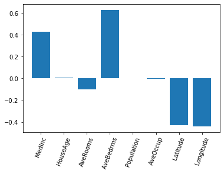
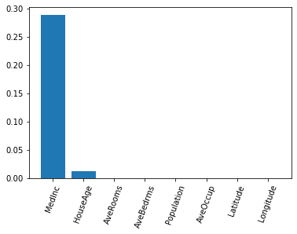

### Questions

### Objectives
YWBAT 
- explain bias/variance tradeoff
- explain ridge regression
- explain lasso regression
- explain AIC and BIC

### What are the assumptions of linear regression? 

**Features and Target**
- Linear Relationship between the features and the target
- Multicollinearity - features cannot have multicollinearity

**Assumptions on your Residuals**
- Normality Assumption
- Homoskedacicity - want this to be true of the residuals
- Autocorrelation - no correlation between features and residuals

### Outline


```python
import pandas as pd
import numpy as np

import statsmodels.api as sm

from sklearn.linear_model import Lasso, Ridge, LinearRegression
from sklearn.datasets import california_housing
from sklearn.model_selection import train_test_split


import matplotlib.pyplot as plt
```


```python
cal_housing = california_housing.fetch_california_housing()
```

    Downloading Cal. housing from https://ndownloader.figshare.com/files/5976036 to /Users/rcarrasco/scikit_learn_data


```python
y = cal_housing.target
X = cal_housing.data
features = cal_housing.feature_names
```


```python
df = pd.DataFrame(X, columns=features)
df['target'] = y
df.head()
```


<div>
<style scoped>
    .dataframe tbody tr th:only-of-type {
        vertical-align: middle;
    }

    .dataframe tbody tr th {
        vertical-align: top;
    }

    .dataframe thead th {
        text-align: right;
    }
</style>
<table border="1" class="dataframe">
  <thead>
    <tr style="text-align: right;">
      <th></th>
      <th>MedInc</th>
      <th>HouseAge</th>
      <th>AveRooms</th>
      <th>AveBedrms</th>
      <th>Population</th>
      <th>AveOccup</th>
      <th>Latitude</th>
      <th>Longitude</th>
      <th>target</th>
    </tr>
  </thead>
  <tbody>
    <tr>
      <td>0</td>
      <td>8.3252</td>
      <td>41.0</td>
      <td>6.984127</td>
      <td>1.023810</td>
      <td>322.0</td>
      <td>2.555556</td>
      <td>37.88</td>
      <td>-122.23</td>
      <td>4.526</td>
    </tr>
    <tr>
      <td>1</td>
      <td>8.3014</td>
      <td>21.0</td>
      <td>6.238137</td>
      <td>0.971880</td>
      <td>2401.0</td>
      <td>2.109842</td>
      <td>37.86</td>
      <td>-122.22</td>
      <td>3.585</td>
    </tr>
    <tr>
      <td>2</td>
      <td>7.2574</td>
      <td>52.0</td>
      <td>8.288136</td>
      <td>1.073446</td>
      <td>496.0</td>
      <td>2.802260</td>
      <td>37.85</td>
      <td>-122.24</td>
      <td>3.521</td>
    </tr>
    <tr>
      <td>3</td>
      <td>5.6431</td>
      <td>52.0</td>
      <td>5.817352</td>
      <td>1.073059</td>
      <td>558.0</td>
      <td>2.547945</td>
      <td>37.85</td>
      <td>-122.25</td>
      <td>3.413</td>
    </tr>
    <tr>
      <td>4</td>
      <td>3.8462</td>
      <td>52.0</td>
      <td>6.281853</td>
      <td>1.081081</td>
      <td>565.0</td>
      <td>2.181467</td>
      <td>37.85</td>
      <td>-122.25</td>
      <td>3.422</td>
    </tr>
  </tbody>
</table>
</div>


### Why don't we want multicollinearity? What does this cause?

Takes away from linear equation

if 2 features f1 and f2 are correlated

yhat = b0 + b1f1 + b2f2

giving these some numbers


gallons_per_mile = 2.5 x car_weight + 3.8 x engine_size

increase car_weight by 1 -> gallons_per_mile increasing by 2.5

because these are multicollinear the 2.5 and 3.8 don't mean anything. 


```python
# let's build an OLS model using statsmodels (baseline)
ols = sm.OLS(y, df.drop("target", axis=1))
results = ols.fit()
```


```python
results.summary()
```


<table class="simpletable">
<caption>OLS Regression Results</caption>
<tr>
  <th>Dep. Variable:</th>            <td>y</td>        <th>  R-squared (uncentered):</th>      <td>   0.892</td> 
</tr>
<tr>
  <th>Model:</th>                   <td>OLS</td>       <th>  Adj. R-squared (uncentered):</th> <td>   0.892</td> 
</tr>
<tr>
  <th>Method:</th>             <td>Least Squares</td>  <th>  F-statistic:       </th>          <td>2.137e+04</td>
</tr>
<tr>
  <th>Date:</th>             <td>Thu, 12 Sep 2019</td> <th>  Prob (F-statistic):</th>           <td>  0.00</td>  
</tr>
<tr>
  <th>Time:</th>                 <td>17:33:56</td>     <th>  Log-Likelihood:    </th>          <td> -24087.</td> 
</tr>
<tr>
  <th>No. Observations:</th>      <td> 20640</td>      <th>  AIC:               </th>          <td>4.819e+04</td>
</tr>
<tr>
  <th>Df Residuals:</th>          <td> 20632</td>      <th>  BIC:               </th>          <td>4.825e+04</td>
</tr>
<tr>
  <th>Df Model:</th>              <td>     8</td>      <th>                     </th>              <td> </td>    
</tr>
<tr>
  <th>Covariance Type:</th>      <td>nonrobust</td>    <th>                     </th>              <td> </td>    
</tr>
</table>
<table class="simpletable">
<tr>
       <td></td>         <th>coef</th>     <th>std err</th>      <th>t</th>      <th>P>|t|</th>  <th>[0.025</th>    <th>0.975]</th>  
</tr>
<tr>
  <th>MedInc</th>     <td>    0.5135</td> <td>    0.004</td> <td>  120.594</td> <td> 0.000</td> <td>    0.505</td> <td>    0.522</td>
</tr>
<tr>
  <th>HouseAge</th>   <td>    0.0157</td> <td>    0.000</td> <td>   33.727</td> <td> 0.000</td> <td>    0.015</td> <td>    0.017</td>
</tr>
<tr>
  <th>AveRooms</th>   <td>   -0.1825</td> <td>    0.006</td> <td>  -29.673</td> <td> 0.000</td> <td>   -0.195</td> <td>   -0.170</td>
</tr>
<tr>
  <th>AveBedrms</th>  <td>    0.8651</td> <td>    0.030</td> <td>   28.927</td> <td> 0.000</td> <td>    0.806</td> <td>    0.924</td>
</tr>
<tr>
  <th>Population</th> <td> 7.792e-06</td> <td> 5.09e-06</td> <td>    1.530</td> <td> 0.126</td> <td>-2.19e-06</td> <td> 1.78e-05</td>
</tr>
<tr>
  <th>AveOccup</th>   <td>   -0.0047</td> <td>    0.001</td> <td>   -8.987</td> <td> 0.000</td> <td>   -0.006</td> <td>   -0.004</td>
</tr>
<tr>
  <th>Latitude</th>   <td>   -0.0639</td> <td>    0.004</td> <td>  -17.826</td> <td> 0.000</td> <td>   -0.071</td> <td>   -0.057</td>
</tr>
<tr>
  <th>Longitude</th>  <td>   -0.0164</td> <td>    0.001</td> <td>  -14.381</td> <td> 0.000</td> <td>   -0.019</td> <td>   -0.014</td>
</tr>
</table>
<table class="simpletable">
<tr>
  <th>Omnibus:</th>       <td>4353.392</td> <th>  Durbin-Watson:     </th> <td>   0.909</td> 
</tr>
<tr>
  <th>Prob(Omnibus):</th>  <td> 0.000</td>  <th>  Jarque-Bera (JB):  </th> <td>14087.489</td>
</tr>
<tr>
  <th>Skew:</th>           <td> 1.069</td>  <th>  Prob(JB):          </th> <td>    0.00</td> 
</tr>
<tr>
  <th>Kurtosis:</th>       <td> 6.436</td>  <th>  Cond. No.          </th> <td>1.03e+04</td> 
</tr>
</table><br/><br/>Warnings:<br/>[1] Standard Errors assume that the covariance matrix of the errors is correctly specified.<br/>[2] The condition number is large, 1.03e+04. This might indicate that there are<br/>strong multicollinearity or other numerical problems.


Skewness of 1.069 is a bit positively skewed. But pretty close to 0. 

Kurtosis of 6.436 means that we have a lot of outliers. 


```python
df.corr()
```


<div>
<style scoped>
    .dataframe tbody tr th:only-of-type {
        vertical-align: middle;
    }

    .dataframe tbody tr th {
        vertical-align: top;
    }

    .dataframe thead th {
        text-align: right;
    }
</style>
<table border="1" class="dataframe">
  <thead>
    <tr style="text-align: right;">
      <th></th>
      <th>MedInc</th>
      <th>HouseAge</th>
      <th>AveRooms</th>
      <th>AveBedrms</th>
      <th>Population</th>
      <th>AveOccup</th>
      <th>Latitude</th>
      <th>Longitude</th>
      <th>target</th>
    </tr>
  </thead>
  <tbody>
    <tr>
      <td>MedInc</td>
      <td>1.000000</td>
      <td>-0.119034</td>
      <td>0.326895</td>
      <td>-0.062040</td>
      <td>0.004834</td>
      <td>0.018766</td>
      <td>-0.079809</td>
      <td>-0.015176</td>
      <td>0.688075</td>
    </tr>
    <tr>
      <td>HouseAge</td>
      <td>-0.119034</td>
      <td>1.000000</td>
      <td>-0.153277</td>
      <td>-0.077747</td>
      <td>-0.296244</td>
      <td>0.013191</td>
      <td>0.011173</td>
      <td>-0.108197</td>
      <td>0.105623</td>
    </tr>
    <tr>
      <td>AveRooms</td>
      <td>0.326895</td>
      <td>-0.153277</td>
      <td>1.000000</td>
      <td>0.847621</td>
      <td>-0.072213</td>
      <td>-0.004852</td>
      <td>0.106389</td>
      <td>-0.027540</td>
      <td>0.151948</td>
    </tr>
    <tr>
      <td>AveBedrms</td>
      <td>-0.062040</td>
      <td>-0.077747</td>
      <td>0.847621</td>
      <td>1.000000</td>
      <td>-0.066197</td>
      <td>-0.006181</td>
      <td>0.069721</td>
      <td>0.013344</td>
      <td>-0.046701</td>
    </tr>
    <tr>
      <td>Population</td>
      <td>0.004834</td>
      <td>-0.296244</td>
      <td>-0.072213</td>
      <td>-0.066197</td>
      <td>1.000000</td>
      <td>0.069863</td>
      <td>-0.108785</td>
      <td>0.099773</td>
      <td>-0.024650</td>
    </tr>
    <tr>
      <td>AveOccup</td>
      <td>0.018766</td>
      <td>0.013191</td>
      <td>-0.004852</td>
      <td>-0.006181</td>
      <td>0.069863</td>
      <td>1.000000</td>
      <td>0.002366</td>
      <td>0.002476</td>
      <td>-0.023737</td>
    </tr>
    <tr>
      <td>Latitude</td>
      <td>-0.079809</td>
      <td>0.011173</td>
      <td>0.106389</td>
      <td>0.069721</td>
      <td>-0.108785</td>
      <td>0.002366</td>
      <td>1.000000</td>
      <td>-0.924664</td>
      <td>-0.144160</td>
    </tr>
    <tr>
      <td>Longitude</td>
      <td>-0.015176</td>
      <td>-0.108197</td>
      <td>-0.027540</td>
      <td>0.013344</td>
      <td>0.099773</td>
      <td>0.002476</td>
      <td>-0.924664</td>
      <td>1.000000</td>
      <td>-0.045967</td>
    </tr>
    <tr>
      <td>target</td>
      <td>0.688075</td>
      <td>0.105623</td>
      <td>0.151948</td>
      <td>-0.046701</td>
      <td>-0.024650</td>
      <td>-0.023737</td>
      <td>-0.144160</td>
      <td>-0.045967</td>
      <td>1.000000</td>
    </tr>
  </tbody>
</table>
</div>


```python
X = df.drop(["target", "AveRooms", "Latitude", "Longitude"], axis=1)
y = df.target

ols = sm.OLS(y, X)
results = ols.fit()

results.summary()
```


<table class="simpletable">
<caption>OLS Regression Results</caption>
<tr>
  <th>Dep. Variable:</th>         <td>target</td>      <th>  R-squared (uncentered):</th>      <td>   0.884</td> 
</tr>
<tr>
  <th>Model:</th>                   <td>OLS</td>       <th>  Adj. R-squared (uncentered):</th> <td>   0.884</td> 
</tr>
<tr>
  <th>Method:</th>             <td>Least Squares</td>  <th>  F-statistic:       </th>          <td>3.140e+04</td>
</tr>
<tr>
  <th>Date:</th>             <td>Thu, 12 Sep 2019</td> <th>  Prob (F-statistic):</th>           <td>  0.00</td>  
</tr>
<tr>
  <th>Time:</th>                 <td>17:38:19</td>     <th>  Log-Likelihood:    </th>          <td> -24870.</td> 
</tr>
<tr>
  <th>No. Observations:</th>      <td> 20640</td>      <th>  AIC:               </th>          <td>4.975e+04</td>
</tr>
<tr>
  <th>Df Residuals:</th>          <td> 20635</td>      <th>  BIC:               </th>          <td>4.979e+04</td>
</tr>
<tr>
  <th>Df Model:</th>              <td>     5</td>      <th>                     </th>              <td> </td>    
</tr>
<tr>
  <th>Covariance Type:</th>      <td>nonrobust</td>    <th>                     </th>              <td> </td>    
</tr>
</table>
<table class="simpletable">
<tr>
       <td></td>         <th>coef</th>     <th>std err</th>      <th>t</th>      <th>P>|t|</th>  <th>[0.025</th>    <th>0.975]</th>  
</tr>
<tr>
  <th>MedInc</th>     <td>    0.4210</td> <td>    0.003</td> <td>  165.642</td> <td> 0.000</td> <td>    0.416</td> <td>    0.426</td>
</tr>
<tr>
  <th>HouseAge</th>   <td>    0.0160</td> <td>    0.000</td> <td>   45.980</td> <td> 0.000</td> <td>    0.015</td> <td>    0.017</td>
</tr>
<tr>
  <th>AveBedrms</th>  <td>   -0.0185</td> <td>    0.010</td> <td>   -1.902</td> <td> 0.057</td> <td>   -0.038</td> <td>    0.001</td>
</tr>
<tr>
  <th>Population</th> <td> 1.665e-05</td> <td>  4.6e-06</td> <td>    3.618</td> <td> 0.000</td> <td> 7.63e-06</td> <td> 2.57e-05</td>
</tr>
<tr>
  <th>AveOccup</th>   <td>   -0.0047</td> <td>    0.001</td> <td>   -8.713</td> <td> 0.000</td> <td>   -0.006</td> <td>   -0.004</td>
</tr>
</table>
<table class="simpletable">
<tr>
  <th>Omnibus:</th>       <td>4262.669</td> <th>  Durbin-Watson:     </th> <td>   0.758</td>
</tr>
<tr>
  <th>Prob(Omnibus):</th>  <td> 0.000</td>  <th>  Jarque-Bera (JB):  </th> <td>9935.375</td>
</tr>
<tr>
  <th>Skew:</th>           <td> 1.167</td>  <th>  Prob(JB):          </th> <td>    0.00</td>
</tr>
<tr>
  <th>Kurtosis:</th>       <td> 5.471</td>  <th>  Cond. No.          </th> <td>3.16e+03</td>
</tr>
</table><br/><br/>Warnings:<br/>[1] Standard Errors assume that the covariance matrix of the errors is correctly specified.<br/>[2] The condition number is large, 3.16e+03. This might indicate that there are<br/>strong multicollinearity or other numerical problems.


### What is the goal of linear regression?

Predict a target based on features

What are we using to make these predictions?
- Parameters, also known as, coefficients, also known as, weights


How do we find the best parameters?
- Something to do with smallest error...yes that is true
- Least Mean Squared Error...
- The best way to find Parameters is using Gradient Descent


### What is Gradient Descent?
- is a Process
- What are the ingredients for Gradient Descent?
    - initial guess of our Parameters
    - Loss Function -> Way of Calculating Error
    - You update weights based on gradient of Error w/ respect to Parameters
    - Then weights with the lowest error are chosen

### What happens in linear regression is if I add hundreds of features...

- You overfit, but your r2 goes up and error goes down
    - and gradient descent is trying to minimize error
- this is where ridge and lasso come in
    - these punish using a lot of parameters
    - what else do these do?
        - ensures optimal parameters
        - prevents us from overfitting


```python
xtrain, xtest, ytrain, ytest = train_test_split(df.drop('target', axis=1), df.target, test_size=0.20)
```

### Out of the box linear regerssion


```python
linreg = LinearRegression()
linreg.fit(xtrain, ytrain)
linreg.score(xtest, ytest)
```


    0.6200923803673022


```python
plt.bar(features, linreg.coef_)
plt.xticks(range(len(linreg.coef_)), features, rotation=70)
plt.show()
```





### Ridge regression


```python
ridge = Ridge(alpha=10.0)
ridge.fit(xtrain, ytrain)

ridge.score(xtest, ytest)
```


    0.620053583047234


```python
ridge.coef_.sum()
```


    0.08746926231461982


```python
plt.bar(features, ridge.coef_)
plt.xticks(range(len(ridge.coef_)), features, rotation=70)
plt.show()
```


### Lasso 


```python
lasso = Lasso(alpha=0.5)
lasso.fit(xtrain, ytrain)

lasso.score(xtest, ytest)
```


    0.4601413921538754


```python
plt.bar(features, lasso.coef_)
plt.xticks(range(len(lasso.coef_)), features, rotation=70)
plt.show()
```





```python

```


```python

```

### Some Formulas

#### AIC/ BIC


#### Lasso Regression


#### Ridge Regression


### Still need to plan


```python

```


```python

```


```python

```


```python

```

### Some deep thinking

Why would one want to use ridge over lasso over no penalty regression? What do these affect? Why are these important?


```python

```


```python

```

### Assessment

### What did we learn
- The issues with linear regression
    - residuals need to be normal
    - We need multicollinearity
- Learned about Gradient Descent
    - That it's a process of finding the least amount of error by finding the best parameters
- Lasso and Ridge Regression
    - Help us find best parameters by penalizing the number of parameters we use
    - Prevent overfitting
